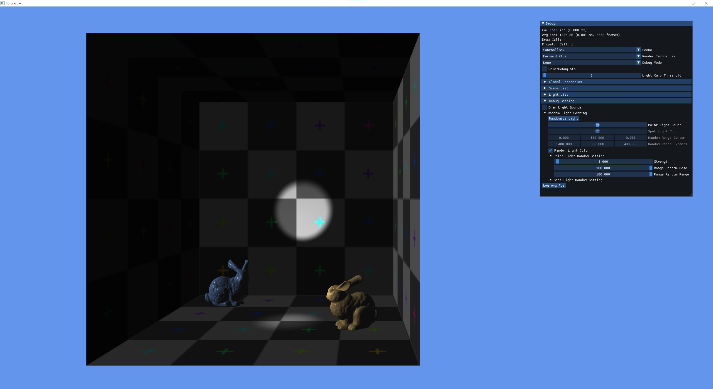
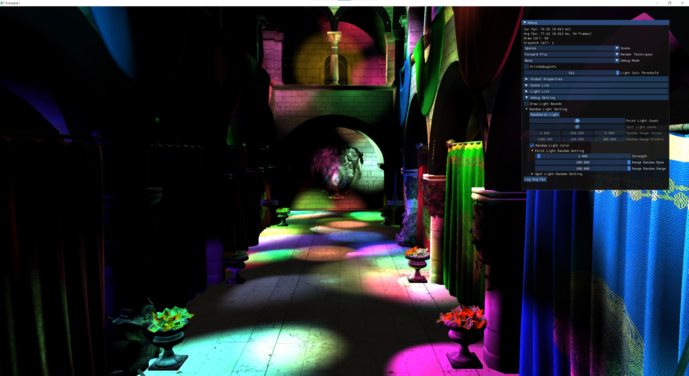
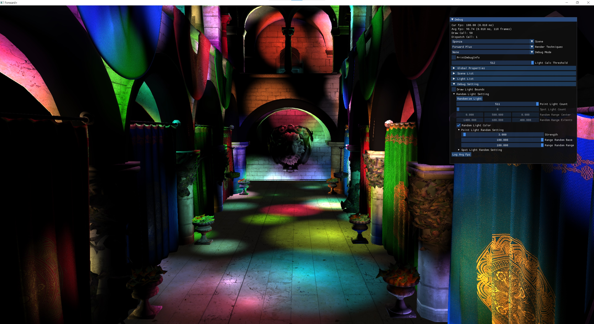
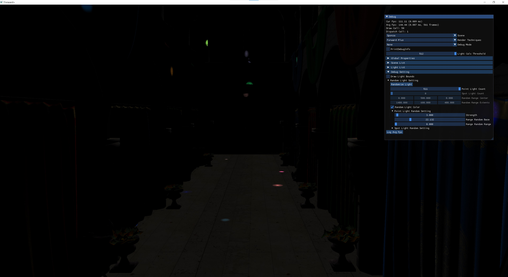

# Forward+

Learning and implement Forward+ using DX11 & DirectXMath. For more details please refer to [Project Readme](dx11-forwardplus/readme.md).

## Table of Contents

* [Comparsions](#comparsions)
    * [Frame per second](#frame-per-second)
    * [Increate Ratio to Forward Rendering](#increate-ratio-to-forward-rendering)
    * [Explanations](#explanations)
* [Screenshots](#screenshots)
    * [Cornell Box, 1 Directional Light + 1 Point Light + 1 Spot Light](#cornell-box-1-directional-light--1-point-light--1-spot-light)
    * [Sponza, 1 Directional Light + 256 Point Light + 255 Spot Light](#sponza-1-directional-light--256-point-light--255-spot-light)
    * [Sponza, 1 Directional Light + 511 Large Point Light](#sponza-1-directional-light--511-large-point-light)
    * [Sponza, 1 Directional Light + 511 Small Point Light](#sponza-1-directional-light--511-small-point-light)

## Comparsions

We compare the performance between forward rendering, deferred rendering (native approach & light volumes), and forward plus.

The scene is rendered in 4K resolution on my PC (Intel Core Ultra 7 265K & Nvidia RTX 5060 Ti).

To focus on comparison, our scene contains only opaque objects that use Phong shading (no normal mapping or alpha clipping).

For scene details, please refer to the [Screenshots](#screenshots).

We also use the following abbreviations in the tables below:
* Dir = Directional Light
* PL = Point Light
* SPL = Spot Light
* N = Native approach
* LV = Light volume

### Frame per second

| Scene | Forward | Deferred (N) | Deferred (LV) |Forward+ |
| --- | --- | --- | --- | --- |
| Cornell Box (1 Dir + 1 PL + 1 SPL)            | 2069.83 | 1875.71 | 1621.42 | 1863.6 |
| Sponza (1 Dir + 256 Large PL + 255 Large SPL) | 16.46   | 59.29   | 86.14   | 87.67  |
| Sponza (1 Dir + 511 Large PL)                 | 18.93   | 63.82   | 112.54  | 126.58 |
| Sponza (1 Dir + 511 Small PL)                 | 17.22   | 64.43   | 126.26  | 143.56 |

### Explanations

* For Cornell Box scene, since we only have few lights, other render techniques cost more time due to more draw calls
    * Forward: Final pass (2 Draw Calls, one for cornell box, another for instanced standford bunny)
    * Deferred: G-Buffer pass (2 Draw Calls) + Final pass (3 Draw Calls)
    * Deferred (Light Volume): G-Buffer pass (2 Draw Calls) + Final pass (3x2 Draw Calls)
        * For each light we draw light volume twice to perform stencil tests
    * Forward+: Depth Prepass (2 Draw Calls) + Cull Light pass (1) + Final pass (2 Draw Calls)
* For Sponza scene, we can observe:
    * Forward+ has the best performance
    * Light sizes does not affect performances of Forward & Deferred Rendering (Native)
    * Forward+ and Deferred rendering (light volume) may perform better when light size is small, since many light calculation can be culled

## Screenshots

### Cornell Box, 1 Directional Light + 1 Point Light + 1 Spot Light

### Sponza, 1 Directional Light + 256 Point Light + 255 Spot Light

### Sponza, 1 Directional Light + 511 Large Point Light

### Sponza, 1 Directional Light + 511 Small Point Light

