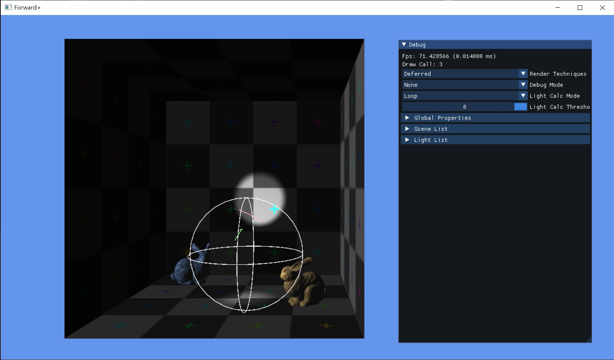

# Forward+

Learning and implement Forward+ using DX11 & DirectXMath. For more details please refer to [Project Readme](dx11-forwardplus/readme.md).

## Screenshots

* Cornell Box + Standford Bunny (Instanced) with v-sync, 3 lights
    * Forward: Final pass (2 Draw Calls)
    * Deferred: G-Buffer pass (2 Draw Calls) + Final pass (1 Draw Calls)
    * Forward+: Depth Prepass (2 Draw Calls) + Cull Light pass (1) + Final pass (2 Draw Calls)
    * No slight performance difference in this test scene (even if we don't uses v-sync)

| Forward | Deferred | Forward+ |
| --- | --- | --- |
|  |  |  |